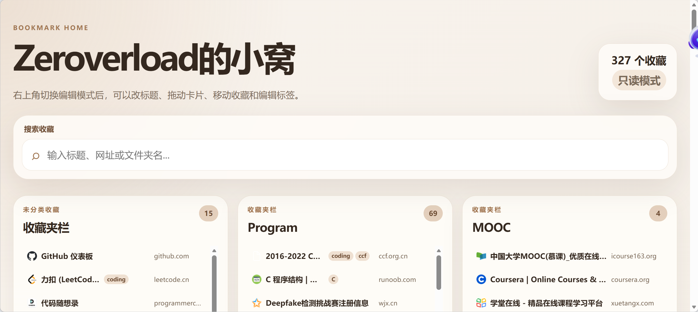
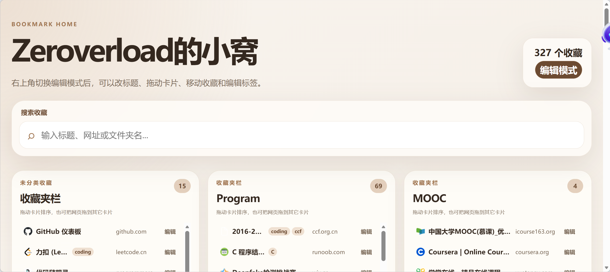
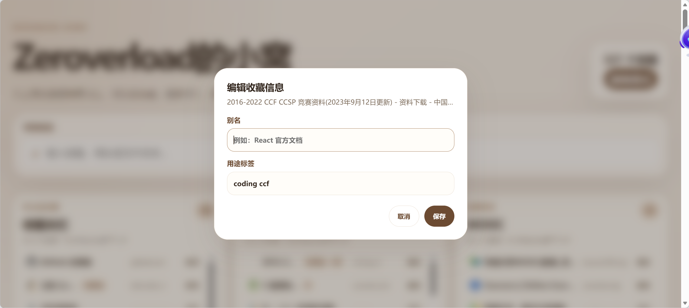

# Bookmark Home

Bookmark Home 是一个本地优先的 Edge 浏览器扩展，把新标签页变成收藏夹卡片主页。它可以按卡片展示收藏夹，支持搜索、别名、用途标签、卡片排序，以及在编辑模式下移动收藏到其它收藏夹。

## 效果展示
- 只读模式

- 编辑模式




## Features

- 将浏览器新标签页替换为收藏夹主页。
- 将一级收藏夹文件夹展示为淡棕色 + 白色卡片。
- 每个收藏网页固定为单行展示，包含网站图标、标题 / 别名、标签和域名。
- 支持按标题、别名、URL、域名、文件夹路径、用途标签搜索。
- 支持 `只读模式` 和 `编辑模式` 切换。
- 编辑模式下支持自定义主页标题。
- 编辑模式下支持修改卡片显示名称。
- 编辑模式下支持拖动卡片调整展示顺序。
- 编辑模式下支持为收藏网页添加别名和用途标签。
- 编辑模式下支持把收藏网页拖到另一个收藏夹卡片中。


## Safety and Privacy

Bookmark Home 不包含后端服务，不包含网络请求，不上传用户数据。

- 本地显示设置保存在 `chrome.storage.local`。
- 别名、标签、卡片顺序、卡片显示名、主页标题只保存在本地扩展存储中。
- 读取收藏夹需要 `bookmarks` 权限。
- 在 `只读模式` 下不会修改浏览器收藏夹。
- 在 `编辑模式` 下，将网页拖到其它卡片会调用浏览器收藏夹 API，真实移动该收藏的位置。

更多说明见 `PRIVACY.md` 和 `SECURITY.md`。

## Permissions

| Permission | Purpose |
| --- | --- |
| `bookmarks` | 读取收藏夹树；编辑模式下移动收藏到其它文件夹。 |
| `storage` | 保存主页标题、卡片顺序、卡片别名、网页别名、标签和模式状态。 |
| `favicon` | 显示收藏网站图标。 |

## Install Locally

### Microsoft Edge

1. 打开 `edge://extensions/`。
2. 开启 `开发人员模式`。
3. 点击 `加载解压缩的扩展`。
4. 选择本项目目录 `edge-bookmark-home`。
5. 新建标签页即可使用。

### Google Chrome

1. 打开 `chrome://extensions/`。
2. 开启 `Developer mode`。
3. 点击 `Load unpacked`。
4. 选择本项目目录 `edge-bookmark-home`。
5. 新建标签页即可使用。

## Usage

- 默认进入 `只读模式`，可以搜索和打开收藏。
- 点击右上角模式按钮切换到 `编辑模式`。
- 编辑模式下，点击主页大标题可修改主页标题。
- 编辑模式下，点击卡片标题可修改卡片显示名称。
- 编辑模式下，拖动卡片可调整页面展示顺序。
- 编辑模式下，点击收藏行右侧 `编辑` 可添加别名和用途标签。
- 编辑模式下，拖动收藏网页到另一张卡片，会移动真实浏览器收藏。

## Project Structure

```text
edge-bookmark-home
├─ .github
│  ├─ ISSUE_TEMPLATE
│  │  ├─ bug_report.md
│  │  └─ feature_request.md
│  └─ pull_request_template.md
├─ src
│  ├─ app.js
│  └─ styles.css
├─ .gitignore
├─ LICENSE
├─ PRIVACY.md
├─ README.md
├─ SECURITY.md
├─ manifest.json
└─ newtab.html
```

## Development

当前项目没有构建步骤，也没有外部依赖。修改文件后，在浏览器扩展管理页点击“重新加载”即可测试。

可做的快速校验：

```bash
node --check src/app.js
node -e "JSON.parse(require('fs').readFileSync('manifest.json', 'utf8'))"
```


## Roadmap

- 添加扩展图标和商店截图。
- 添加移动收藏前确认或撤销功能。
- 添加配置导出 / 导入。
- 支持隐藏指定文件夹。
- 支持重复收藏检测。
- 支持常用收藏置顶。

## Contributing

欢迎提交 issue 和 pull request。提交前请确保：

- 没有引入远程脚本或不必要的网络请求。
- 没有扩大权限范围，除非 README 和隐私说明同步解释原因。
- `src/app.js` 可以通过语法检查。

